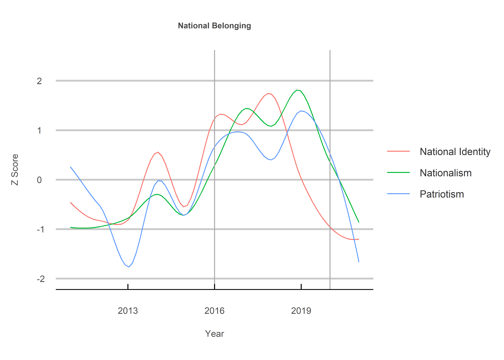
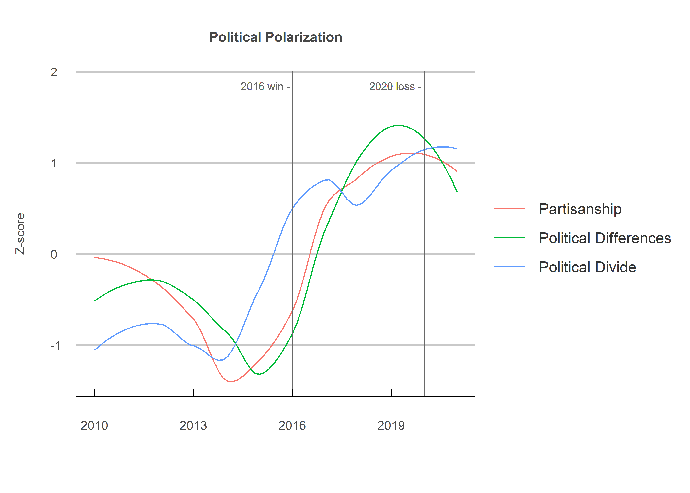
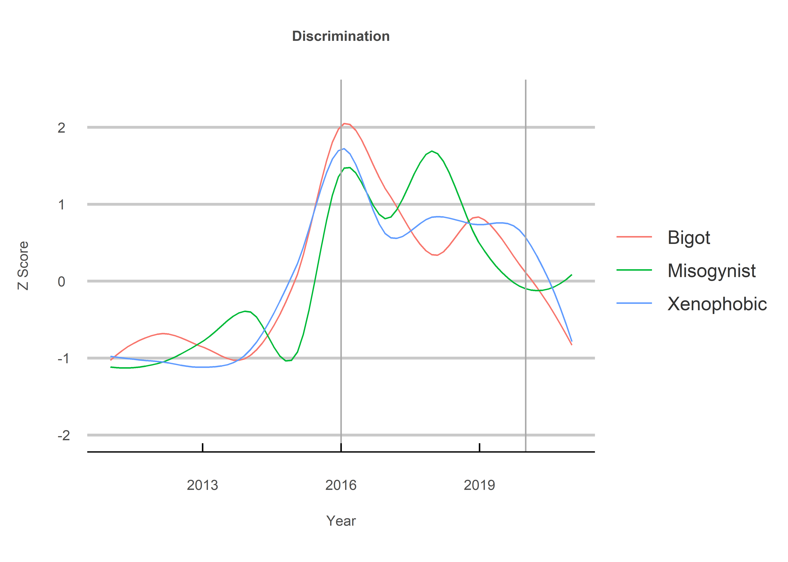

The Good, the Bad and the Ugly
================
Jack Carter
10/17/2021

## **Summary**

This project shows how the conversation in the New York Times (NYT)
turned for the worse following the 2016 election of Donald Trump. A
strong sense of national belonging is undoubtedly good for any country,
yet Trump’s rise was also accompanied by a growing distrust in the media
and increased social discrimination. While this data may indicate a
decline in such rhetoric following Joe Biden’s 2020 victory, the
underlying views of many Americans who do not read or contribute to
liberal newspapers like the NYT have likely not changed.

 

## **Method**

**1) Data Collection:**

The data used in this study are collected from the NYT API. They include
metadata indicating the number of articles that contain certain terms
for each year between 2011 and 2021.

**2) Z Scores:**

The z scores are then calculated as the raw value less the term’s mean,
divided by the term’s standard deviation. This allows us to compare the
relative trajectory of terms regardless of their overall count during
Trump’s presidency.

 

## 1\) The Good

<!-- -->

## 2\) The Bad

<!-- -->

## 3\) The Ugly

<!-- -->

 

## **Sources**

  - New York Times (2021) <https://developer.nytimes.com/apis>

  - Statology (2021) <https://www.statology.org/interpret-z-scores/>
