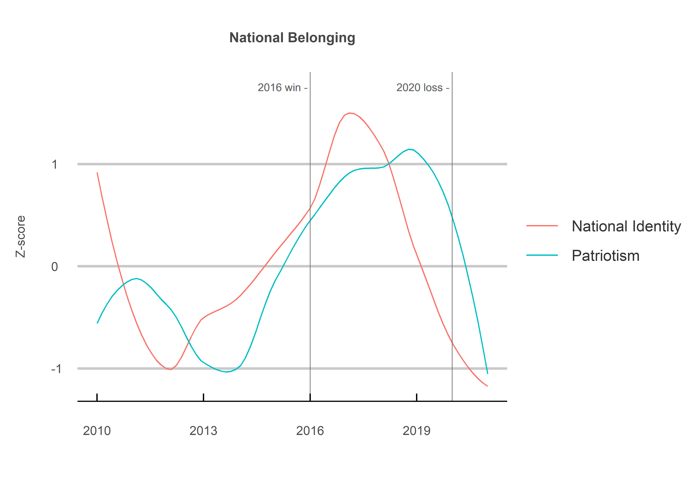

The Good, the Bad and the Ugly
================
Jack Carter
10/17/2021

## **Summary**

This project shows how the conversation in the New York Times (NYT)
turned ugly following the 2016 election of Donald Trump. A strong sense
of national belonging is undoubtedly good for any country, yet Trump’s
rise was also accompanied by discrimination, the emboldening of extreme
groups, political polarization, post-truth era disinformation and
widespread skepticism in the legitimacy of the 2020 election.

 

## **Method**

**1) Data Collection:**

The data used in this study were collected from the New York Times (NYT)
API, including the number of articles containing certain terms for each
year between 2011 and 2021.

 

**2) Z Scores:**

The z scores were calculated as the raw number of articles containing a
certain, less that term’s mean, divided by its standard deviation. This
standardizes the scores, allowing for a comparison of the relative
trajectory of terms.

 

**2) Loess Transformation:**

The data for each term is then plotted with the use of a loess
regression line. This smoothens out the data into a curve for a better
visualization of overall trends.

 

## 1\) The Good

<!-- -->

## 2\) The Bad

<!-- --><!-- -->

## 3\) The Ugly

<!-- --><!-- --><!-- -->

 

## **Sources**

  - New York Times (2021) <https://developer.nytimes.com/apis>

  - Statology (2021) <https://www.statology.org/interpret-z-scores/>
